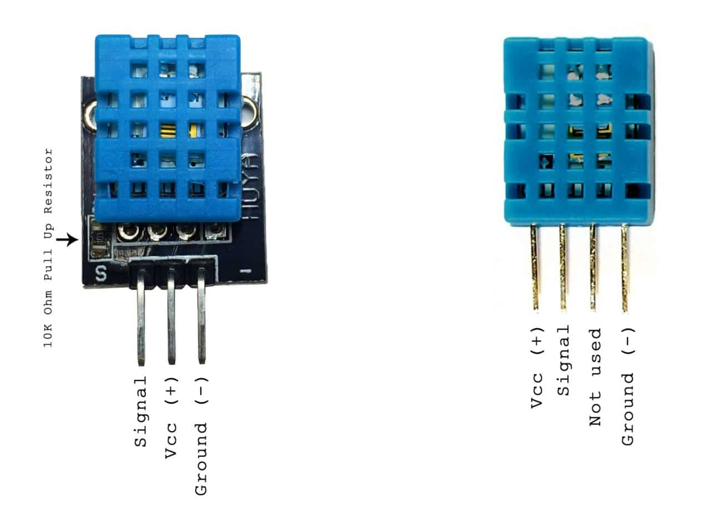

# dht11_gpio

Rust library for interfacing with the DHT11 temperature & humidity sensor.

[crates.io](https://crates.io/crates/dht11_gpio)

## Wiring

Credit goes to this guide on how to properly wire up the sensor  - [circuitbasics.com](https://www.circuitbasics.com/how-to-set-up-the-dht11-humidity-sensor-on-the-raspberry-pi/)

### IMPORTANT!

Connect the `Vcc (+)` to the `3.3v Power`, NOT the 5v Power pin, because the signal would exceed the standard 3.3v of power the input pins take by using a pull-up resistor.


### DHT11 Pinout


### 3 pin


### 4 pin

note: The resistor is a 10K Ohm pull up resistor` connected between the Vcc and signal lines.

## Usage

### Installation

Add the crate to your project:

```shell
cargo add dht11_gpio
```

or add to Cargo.toml manually:

```toml
[dependencies]
dht11_gpio = "0.1.0"
```

check for the latest version on [crates.io/dht11_gpio](https://www.crates.io/dht11_gpio)

### Basic usage

```rust
use dht11_gpio::{DHT11Controller, Sensor};

fn main() {
    const DHT11_PIN: u8 = 4;

    let mut sensor = DHT11Controller::new(DHT11_PIN).unwrap();

    let result = sensor.read_sensor_data();
    match result {
        Ok(data) => {
            println!("temperature: {} °C", data.temperature);
            println!("humidity: {} %", data.humidity);
        }
        Err(err) => {
            println!("error: {}", err);
        }
    }
}


```
note: the sensor returns the temperature in `celcius`


### Possible errors

The `DHT11Controller::read_sensor_data()` method can fail to retrieve the correct sensor data if:


1. Bit Count Mismatch (`DHT11Error::MissingData`):
    - Description: This error occurs when the number of bits received from the DHT11 sensor is not the expected 40 bits (4 bytes of data + 1 byte checksum).
    - Possible Reasons: It may happen due to communication issues or incorrect data reception from the sensor.

2. Invalid Checksum (`DHT11Error::InvalidChecksum`):
    - Description: This error occurs when the calculated checksum (sum of the first 4 bytes) does not match the validation checksum (last byte) received from the DHT11 sensor.
    - Possible Reasons: It indicates a potential corruption or error in the received data. The sensor uses the checksum to validate the integrity of the transmitted information.

The implimentation of `read_sensor_data()` is not perfect as it is implemented with a fixed 200ms timeout for receiving the data from the sensor, this sometimes leads to getting the `MissingData` error.


## References
- wiring guide - [circuitbasics.com](https://www.circuitbasics.com/how-to-set-up-the-dht11-humidity-sensor-on-the-raspberry-pi/)
- [DHT11 datasheet](https://www.mouser.com/datasheet/2/758/DHT11-Technical-Data-Sheet-Translated-Version-1143054.pdf)
- [GPIO pinout](https://pinout.xyz/pinout/pin7_gpio4/)
- [rppal](https://docs.golemparts.com/rppal/) - crate used to interface with the GPIO pins of the raspberry pi through rust